# AI訪問看護記録アシスト 使い方ガイド

訪問看護の記録づくりをAIが手伝うアプリです。音声やメモから **SOAP** を自動で下書きし、各種計画書・報告書も作成できます。

> 画面は `docs/images/` の画像を参照しています。実際のスクリーンショットを同フォルダに保存すると表示されます（→ 巻末「画像ファイルについて」）。

---

## このアプリでできること
- 🎤 **音声・メモから SOAP を自動作成**（看護師が確認・修正してカイポケ等へコピー）
- 👥 **利用者（患者）の管理**・看護内容リスト・受診/往診予定・引き継ぎメモ
- 📄 **書類のAI下書き**：褥瘡計画書／看護計画書／月次報告書／情報提供書
- 🏢 **事業所ごとにデータを分離**。スタッフは参加コード or メール招待で追加

## 準備するもの
- **Googleアカウント**（ログインに使用。新しいメール登録は不要）
- スマホ or パソコンのブラウザ

---

## 1. ログイン
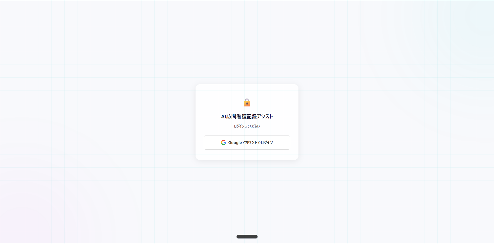

「**Googleアカウントでログイン**」を押し、ふだん使っているGoogleアカウントでログインします。

---

## 2. 事業所の登録（初回のみ）
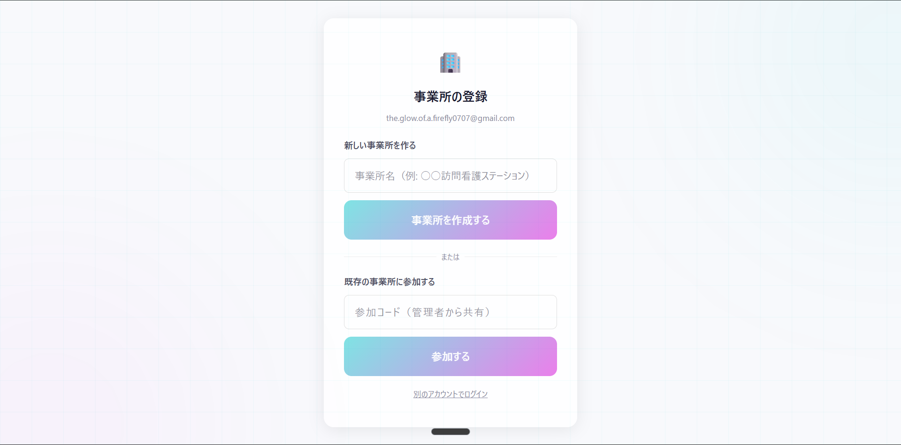

ログイン後、まだどの事業所にも所属していない場合に表示されます。

- **事業所の1人目**：「**新しい事業所を作る**」→ 事業所名を入力 → 作成。**作った人が自動で管理者**になり、**参加コード**が表示されます。
- **2人目以降のスタッフ**：「**既存の事業所に参加する**」に、管理者から共有された**参加コード**を入力。
- 管理者にメールで招待されている場合は、**ログインするだけで自動的に参加**します（コード不要）。

> 💡 同じURLを全事業所で使います。自分の事業所のデータしか見えないので安心です。

---

## 3. ホーム（利用者一覧）
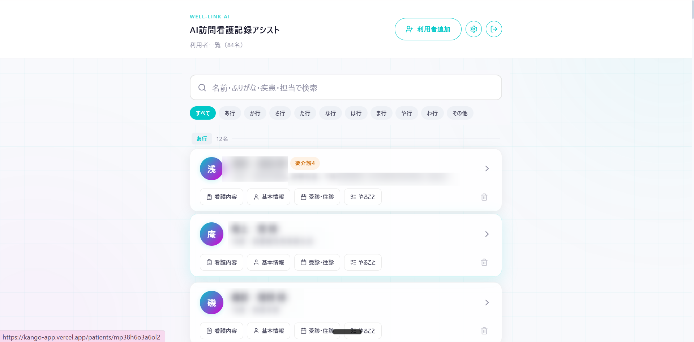

- 上の検索窓で **名前・ふりがな・疾患・担当**で検索できます。
- 「あ行〜わ行」のタブで**ふりがな順**に絞り込み。
- 各利用者カードのボタン：**看護内容／基本情報／受診・往診／やること**。
- 右上の「**＋ 利用者追加**」で新規登録。⚙️は設定、⎋はログアウト。
- 利用者カードをタップすると、その人の詳細（訪問記録の作成・各種書類）に進めます。

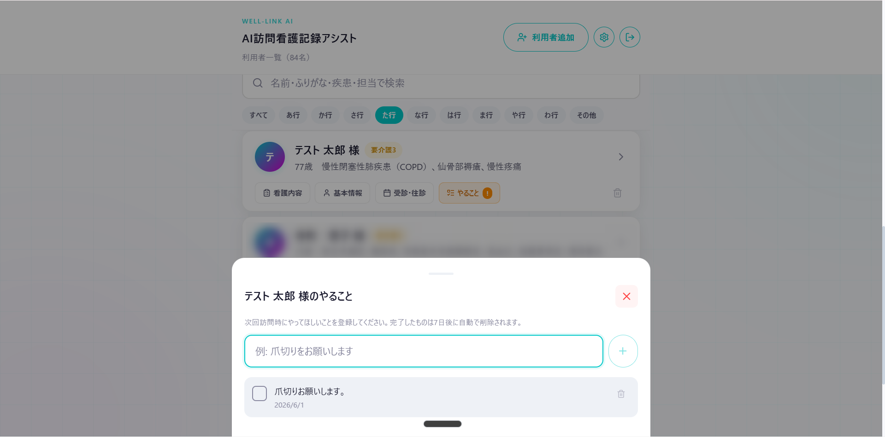

> 「**やること**」は次回訪問への引き継ぎメモ。完了すると7日後に自動で消えます。

---

## 4. 利用者（患者）の登録
「利用者追加」を押すと登録フォームが開きます。

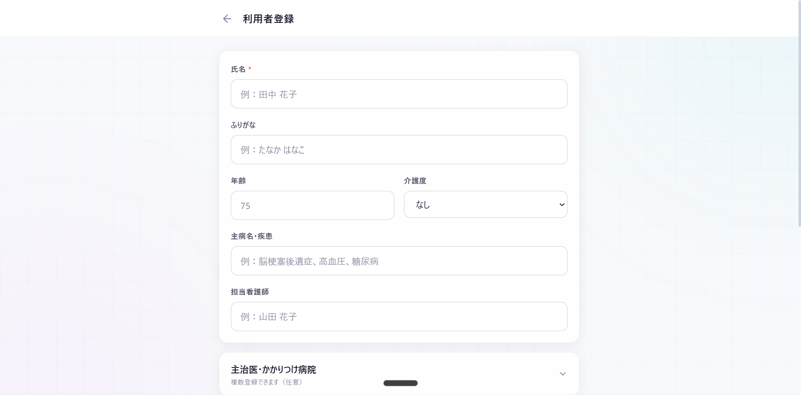

- **氏名（必須）**・ふりがな・年齢・介護度・主病名・担当看護師 を入力。

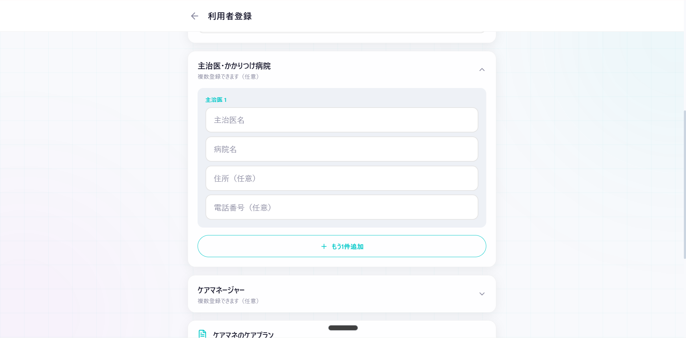

- **主治医・かかりつけ病院**、**ケアマネージャー**は複数登録できます（任意）。

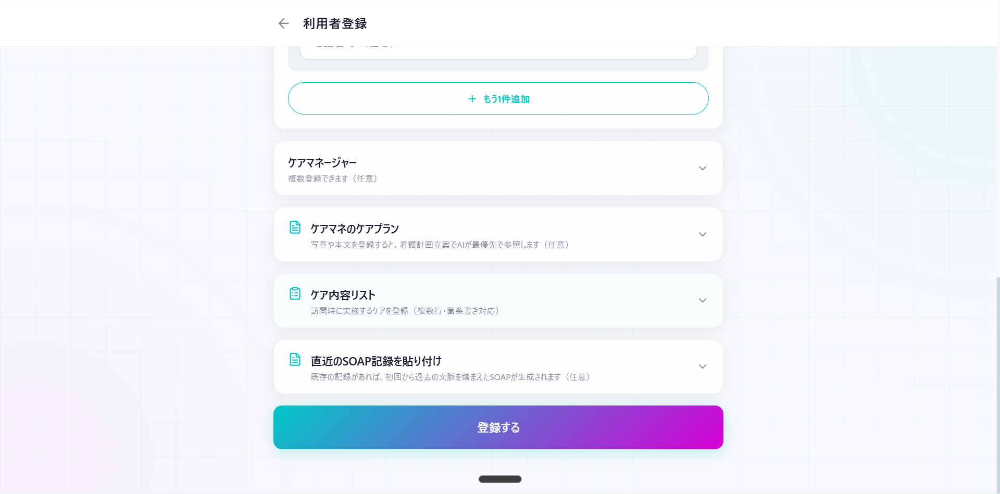

- **ケアマネのケアプラン**（写真／PDF／Excel／本文）… AIが**看護計画立案で最優先に参照**します。
- **ケア内容リスト**、**直近のSOAP記録の貼り付け**（任意）。
- 最後に「**登録する**」。

> 💡 **「ケアマネのケアプラン」は基礎情報（この登録画面）に入れます。** 看護計画を作るときにAIがここを読むため、利用者本体に持たせています。
>
> 📎 **写真・PDF・Excel を添付できます。** AIは**写真とPDFを読み取って**看護計画に反映します（Excelは保存・閲覧のみ）。

---

## 5. 訪問記録（SOAP）を作る
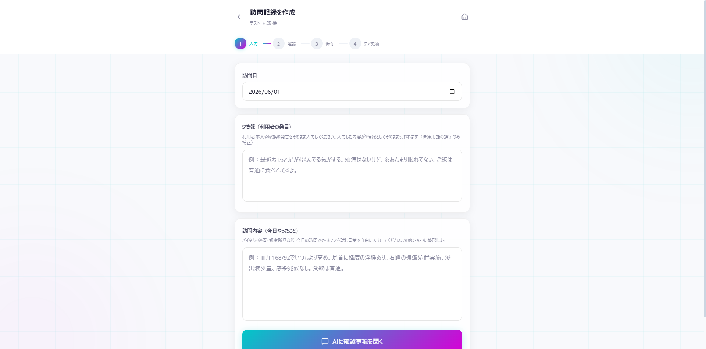

1. 利用者を選び、訪問記録の作成へ。
2. **訪問のメモを入力**します（手入力、またはお使いの音声入力ソフトで文字にしたものを貼り付け）。利用者本人・家族の発言（S情報）があれば入力します。

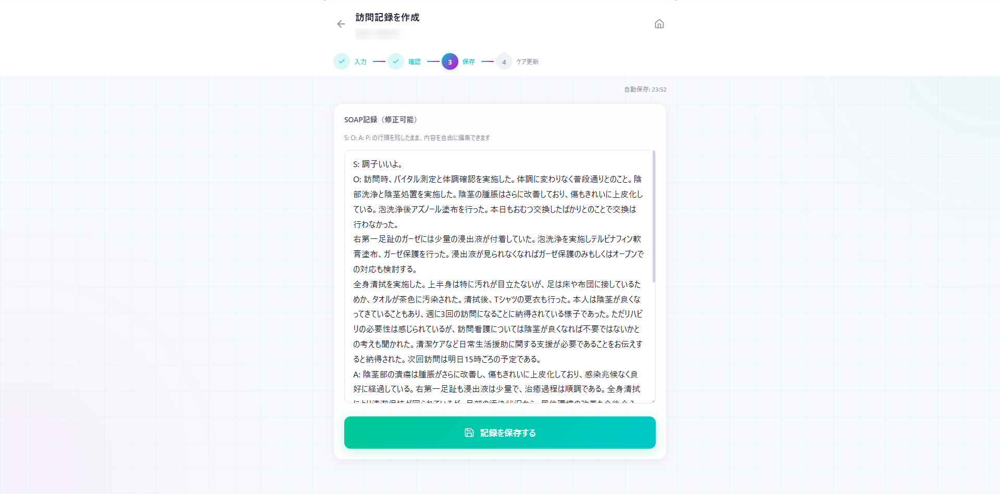

3. 「**SOAPを生成**」を押すと、AIが **S / O / A / P** を下書きします。
4. 内容を**確認・修正**して保存。カイポケ等へコピーできます。

> ⚠️ **AIの出力は下書きです。必ず看護師が確認・修正してください。** 音声の誤変換（例：胃瘻・肉芽・閉眼 等）はできるだけ自動補正していますが、最終確認は必須です。

---

## 6. 看護内容リスト
> 📷 この画面のスクショは未取得です（`docs/images/07-nursing-contents.png` を追加すると表示されます）。

- 記録をAIが分析し、**追加候補・削除候補**を提示します。
- 各候補は「**採用 / 編集して採用 / 却下**」を選べます（削除候補は「削除 / 編集して残す / 却下」）。

---

## 7. 各種書類（AI下書き）

利用者ごとに以下の書類をAIが下書きできます。共通の流れは **必要項目を入力 → AI下書き → 確認・修正 → コピー**。

**褥瘡計画書** — 自立度・危険因子・DESIGN-R を入力 → 看護計画5軸をAI下書き
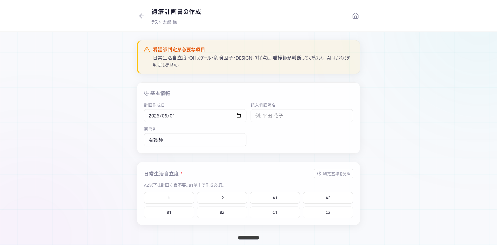

**看護計画書** — 議事録＋記録から課題（NANDA）・OP/TP/EP をAI生成
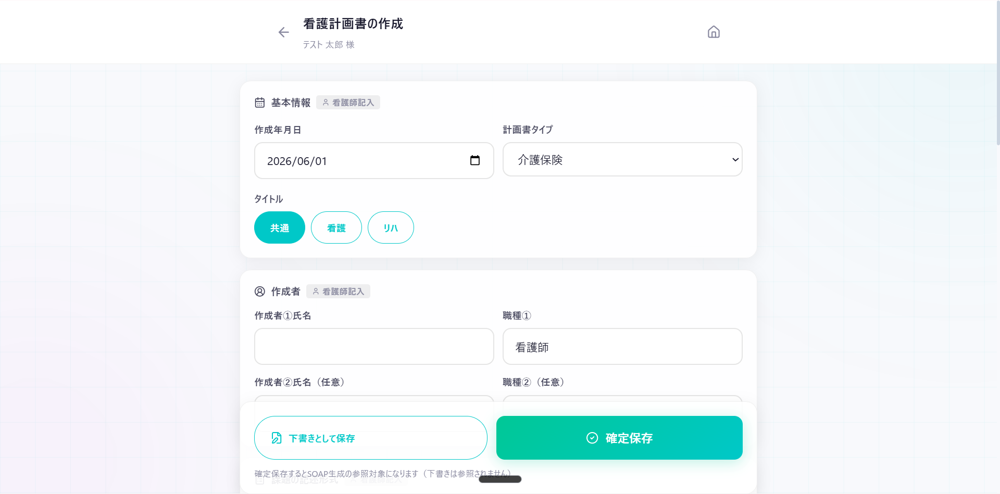

**月次報告書** — 通常／精神科。対象月のSOAPから4欄を下書き
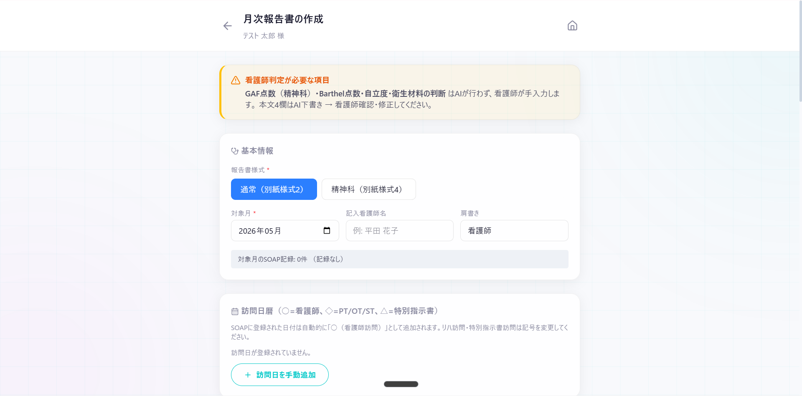

**情報提供書** — 4宛先（市区町村／保健所長／学校／医療機関）別に下書き
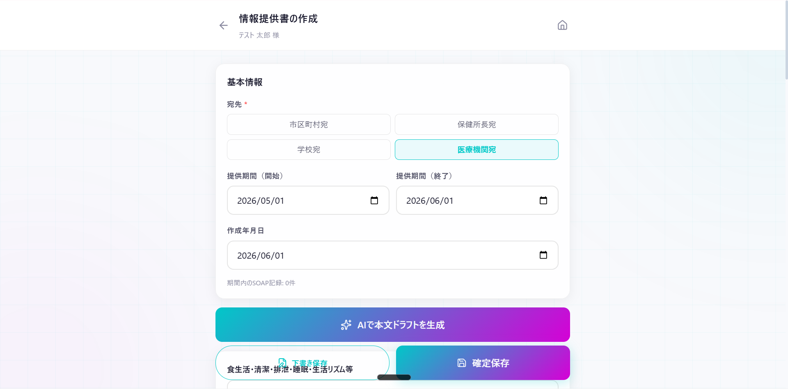

> ⚠️ **点数・判定（Barthel・GAF・DESIGN-R）、宛先の選定、算定区分は看護師が入力**します。AIは本文の下書きのみを担当します。

---

## 8. 管理者向け（事業所・メンバー管理）
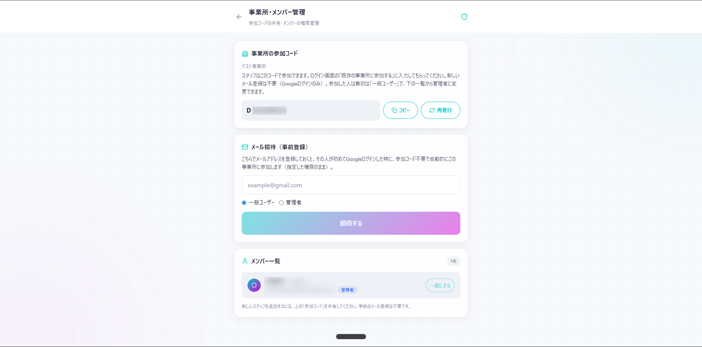

設定（⚙️）→「**事業所・メンバー管理**」（管理者のみ）。

- **参加コード**：スタッフに共有。漏れたら「**再発行**」で作り直し。
- **メール招待**：メールアドレス＋権限（管理者/一般）を登録 → 本人が初回ログインで自動参加。
- **メンバー一覧**：各メンバーを「**管理者⇄一般**」に変更、または事業所から**削除**。
  - ※「最後の管理者」は降格・削除できません（事業所が管理者ゼロになるのを防止）。

---

## 9. 困ったとき
- **AIが混み合っています（エラー）**：1〜2分待ってもう一度。**入力内容は自動保存**されています。
- **保存できない／表示されない**：ページを再読み込み、または一度ログアウト→再ログイン。
- **別の事業所の人やデータが見える**：本来あり得ません。管理者へご連絡ください。
- **スマホでアプリのように使いたい**：ブラウザの「ホーム画面に追加」でアイコン化できます。

---

## 画像ファイルについて（編集者向け）
本ガイドの画像は `docs/images/` に下記のファイル名で保存してください（GitHubで表示されます）。
**患者の個人情報（実名・住所等）はマスキング**するか、テスト患者で撮影してください。

| ファイル名 | 画面 | 状態 |
|---|---|---|
| `01-login.png` | ログイン画面 | ✅ |
| `02-onboarding.png` | 事業所の登録 | ✅ |
| `03-home.png` | 利用者一覧（ホーム） | ✅ |
| `03b-todo.png` | やること（引き継ぎメモ） | ✅ |
| `04a-add-basic.png` | 利用者登録（基本情報） | ✅ |
| `04b-add-doctor.png` | 利用者登録（主治医・ケアマネ） | ✅ |
| `04c-add-careplan.png` | 利用者登録（ケアプラン・登録） | ✅ |
| `05-record-input.png` | 訪問記録の入力 | ✅ |
| `06-record-soap.png` | AIが作ったSOAP | ✅ |
| `07-nursing-contents.png` | 看護内容リスト | ⬜ 未取得 |
| `08a-pressure-ulcer.png` | 褥瘡計画書 | ✅ |
| `08b-nursing-care-plan.png` | 看護計画書 | ✅ |
| `08c-visit-report.png` | 月次報告書 | ✅ |
| `08d-info-provision.png` | 情報提供書 | ✅ |
| `09-admin.png` | 事業所・メンバー管理 | ✅ |
